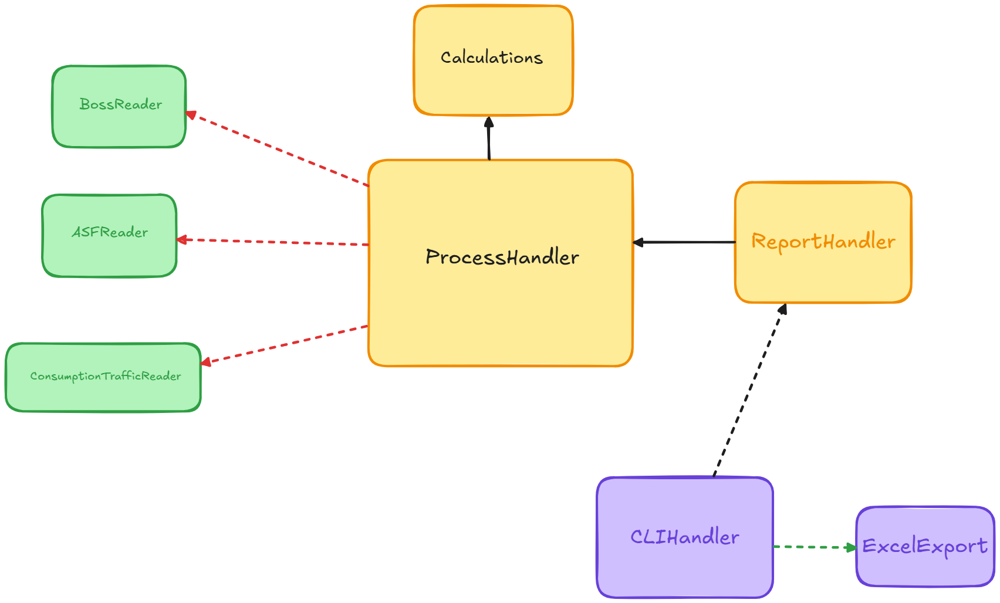

# Consumo por Estado - State Consumption
Automatización en Python para procesar los datos de clientes y consumo de la red para obtener totales por estado.



Para más información sobre los archivos necesarios para el procesamiento, actualización de la base de datos, etc... Puedes consultar el [Manual](./MANUAL.md).

Para más información sobre los diagramas, puedes consultar el [Diagramas en Lucid Chart](https://lucid.app/lucidchart/717878be-76bf-4440-b35e-9003e418ab95/edit?viewport_loc=103%2C-1337%2C5693%2C2663%2C0_0&invitationId=inv_0ec5eacb-0353-4ca4-a540-9f1f48f5675f).

----------------------
# Instalación
Este proyecto es un módulo de Python que se puede instalar con pip.
```bash
pip install .
```

# Requerimientos
## Variables de Entorno
Para poder ejecutar operaciones con la base de datos, es necesario definir la variable de entorno `URI` con la URI de la base de datos en cualquier archivo de configuración.
- Para entorno de desarrollo: `.env.development`
- Para entorno de producción: `.env.production` o `.env`

> *Nota:* Las variables de entorno de desarrollo tiene prioridad sobre las de producción y general. Es recomendable solo definir un archivo de configuración.

# Interfaz de Línea de Comandos
Este módulo tiene una interfaz de línea de comandos (CLI) para poder ejecutar las operaciones.
```bash 
python -m state_consumption --help
```

Para más información sobre las operaciones disponibles, puedes consultar el [Manual](./src/state_consumption/MANUAL.md).
